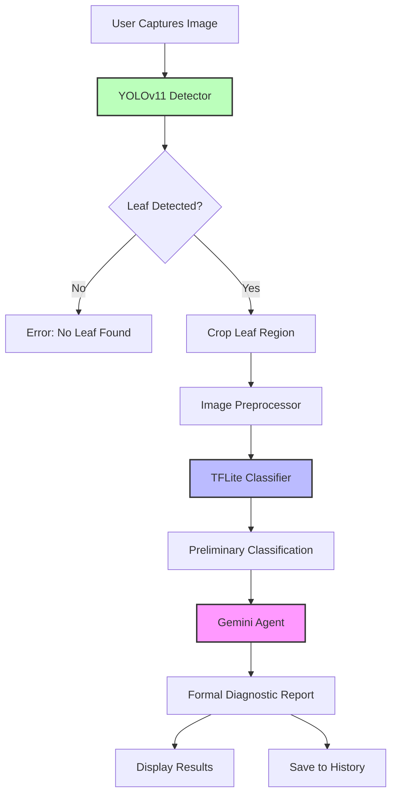

# Design Document: Tomato Leaf Analysis AI Agent

## Overview

The Tomato Leaf Analysis AI Agent is a hybrid Android application that combines YOLOv11 object detection, TensorFlow Lite classification, and Google Gemini AI to provide formal, consistent diagnostic reports for tomato leaf diseases. The system follows a three-stage pipeline: detection → classification → validation/reporting.

### Key Design Principles

1. **Deterministic Output**: Use low-temperature Gemini parameters (temperature=0.0, top_p=0.1, top_k=1) to ensure identical outputs for identical inputs
2. **Formal Reporting**: Generate academic-style diagnostic paragraphs suitable for research and professional use
3. **Consistency First**: Implement caching and preprocessing to maintain result consistency across multiple analyses
4. **Graceful Degradation**: Support fallback modes when Gemini API is unavailable
5. **Mobile-First**: Optimize for Android devices with on-device TFLite inference

## Architecture

### High-Level System Architecture



### Component Architecture

The system follows a layered architecture pattern:

```
┌─────────────────────────────────────────┐
│         Presentation Layer              │
│  (Jetpack Compose UI + ViewModels)     │
└─────────────────────────────────────────┘
                  ↓
┌─────────────────────────────────────────┐
│         Business Logic Layer            │
│  (Analysis Pipeline Orchestrator)       │
└─────────────────────────────────────────┘
                  ↓
┌─────────────────────────────────────────┐
│         ML/AI Services Layer            │
│  YOLOv11 | TFLite | Gemini Agent       │
└─────────────────────────────────────────┘
                  ↓
┌─────────────────────────────────────────┐
│         Data Layer                      │
│  Room DB | Cache | Image Storage        │
└─────────────────────────────────────────┘
```

## Components and Interfaces

### 1. YOLOv11 Detector Service

**Purpose**: Detect and crop tomato leaf regions from input images

**Interface**:
```kotlin
interface LeafDetector {
    /**
     * Detects tomato leaves in the image and returns cropped regions
     * @param bitmap Input image
     * @return List of detected leaf bounding boxes with confidence scores
     */
    suspend fun detectLeaves(bitmap: Bitmap): List<DetectionResult>
    
    /**
     * Crops the highest confidence leaf region from the image
     * @param bitmap Input image
     * @return Cropped leaf bitmap or null if no leaf detected
     */
    suspend fun cropLeaf(bitmap: Bitmap): Bitmap?
}

data class DetectionResult(
    val boundingBox: RectF,
    val confidence: Float,
    val croppedBitmap: Bitmap
)
```

**Implementation Details**:
- Use ONNX Runtime or TensorFlow Lite to run YOLOv11 model
- Model input: 640x640 RGB image
- Model output: Bounding boxes with class probabilities
- Post-processing: NMS (Non-Maximum Suppression) to filter overlapping detections
- Select highest confidence detection for cropping

### 2. TFLite Disease Classifier

**Purpose**: Perform preliminary disease classification on cropped leaf images

**Interface**:
```kotlin
interface DiseaseClassifier {
    /**
     * Classifies the disease present in the leaf image
     * @param bitmap Cropped leaf image (224x224)
     * @return Classification result with disease name and confidence
     */
    suspend fun classify(bitmap: Bitmap): ClassificationResult
    
    /**
     * Gets the list of supported disease classes
     * @return List of disease class names
     */
    fun getSupportedClasses(): List<String>
}

data class ClassificationResult(
    val diseaseClass: String,
    val confidence: Float,
    val allProbabilities: Map<String, Float>
)
```

**Implementation Details**:
- Model: `tomato_disease_model.tflite` (already exists in assets)
- Input: 224x224 RGB normalized image
- Output: 7-class probability distribution
- Classes: Early Blight, Late Blight, Leaf Mold, Septoria Leaf Spot, Bacterial Speck, Healthy Leaf, Uncertain
- Preprocessing: Resize, normalize to [0,1], convert to RGB

### 3. Gemini Agent Service

**Purpose**: Validate TFLite predictions and generate formal diagnostic reports

**Interface**:
```kotlin
interface DiagnosticAgent {
    /**
     * Analyzes the leaf image and generates a formal diagnostic report
     * @param croppedLeaf Cropped leaf image
     * @param preliminaryResult TFLite classification result
     * @return Formal diagnostic report
     */
    suspend fun generateDiagnosticReport(
        croppedLeaf: Bitmap,
        preliminaryResult: ClassificationResult
    ): DiagnosticReport
    
    /**
     * Checks if the agent is available (API key configured, network available)
     * @return True if agent can be used
     */
    fun isAvailable(): Boolean
}

data class DiagnosticReport(
    val diseaseName: String,
    val observedSymptoms: String,
    val confidenceLevel: String,
    val managementRecommendation: String,
    val fullReport: String,
    val isUncertain: Boolean
)
```

**Implementation Details**:
- Use Google Generative AI SDK (already integrated)
- Model: `gemini-2.0-flash-exp` or `gemini-1.5-pro`
- Generation config:
  - temperature: 0.0 (deterministic)
  - topP: 0.1
  - topK: 1
- Prompt structure:
  ```
  You are a plant pathology expert.
  A TFLite model predicted this tomato leaf as "{diseaseClass}" with confidence {confidence}.
  Review the provided image and write a short, formal paragraph report confirming or correcting this diagnosis.
  
  Follow this structure:
  - Start with: "Based on the image analysis, the tomato leaf is identified as **[Disease Name]**."
  - Describe observed symptoms
  - State confidence level
  - Provide management recommendation
  
  Keep response to 3-5 sentences. Use formal academic tone.
  ```

### 4. Analysis Pipeline Orchestrator

**Purpose**: Coordinate the three-stage analysis pipeline

**Interface**:
```kotlin
interface AnalysisPipeline {
    /**
     * Executes the complete analysis pipeline
     * @param inputImage User-provided image
     * @return Complete analysis result
     */
    suspend fun analyze(inputImage: Bitmap): AnalysisResult
    
    /**
     * Executes pipeline in TFLite-only mode (no Gemini)
     * @param inputImage User-provided image
     * @return Analysis result without formal report
     */
    suspend fun analyzeFallback(inputImage: Bitmap): AnalysisResult
}

data class AnalysisResult(
    val success: Boolean,
    val detectionResult: DetectionResult?,
    val classificationResult: ClassificationResult?,
    val diagnosticReport: DiagnosticReport?,
    val errorMessage: String?,
    val processingTimeMs: Long
)
```

**Pipeline Flow**:
1. **Detection Stage**: YOLOv11 detects and crops leaf
   - If no leaf detected → Return error
2. **Classification Stage**: TFLite classifies disease
   - If confidence < 0.5 → Mark as Uncertain
3. **Validation Stage**: Gemini validates and generates report
   - If Gemini unavailable → Use fallback template
4. **Caching**: Store result for consistency
5. **Persistence**: Save to Room database

### 5. Result Cache Manager

**Purpose**: Ensure consistent results for identical inputs

**Interface**:
```kotlin
interface ResultCache {
    /**
     * Retrieves cached result for the given image
     * @param bitmap Input image
     * @return Cached result or null
     */
    suspend fun getCachedResult(bitmap: Bitmap): DiagnosticReport?
    
    /**
     * Caches the analysis result
     * @param bitmap Input image
     * @param report Diagnostic report to cache
     */
    suspend fun cacheResult(bitmap: Bitmap, report: DiagnosticReport)
    
    /**
     * Clears old cache entries
     * @param olderThanDays Remove entries older than specified days
     */
    suspend fun clearOldCache(olderThanDays: Int = 7)
}
```

**Implementation Details**:
- Use perceptual hashing (pHash) to identify similar images
- Store in Room database with hash as key
- TTL: 7 days
- Max cache size: 100 entries (LRU eviction)

### 6. Image Preprocessor

**Purpose**: Standardize images for consistent analysis

**Interface**:
```kotlin
object ImagePreprocessor {
    /**
     * Preprocesses image for YOLOv11 detection
     * @param bitmap Input image
     * @return Preprocessed 640x640 bitmap
     */
    fun preprocessForDetection(bitmap: Bitmap): Bitmap
    
    /**
     * Preprocesses image for TFLite classification
     * @param bitmap Cropped leaf image
     * @return Preprocessed 224x224 bitmap
     */
    fun preprocessForClassification(bitmap: Bitmap): Bitmap
    
    /**
     * Validates image quality
     * @param bitmap Input image
     * @return Quality validation result
     */
    fun validateQuality(bitmap: Bitmap): QualityReport
}

data class QualityReport(
    val isValid: Boolean,
    val score: Float,
    val issues: List<String>
)
```

**Preprocessing Steps**:
- Resize to target dimensions
- Normalize brightness/contrast
- Convert color space if needed
- Apply slight Gaussian blur to reduce noise

## Data Models

### Core Domain Models

```kotlin
// Disease classification result
data class DiseaseClassification(
    val diseaseClass: DiseaseClass,
    val confidence: Float,
    val severity: Severity,
    val timestamp: Long
)

enum class DiseaseClass {
    EARLY_BLIGHT,
    LATE_BLIGHT,
    LEAF_MOLD,
    SEPTORIA_LEAF_SPOT,
    BACTERIAL_SPECK,
    HEALTHY,
    UNCERTAIN
}

enum class Severity {
    HEALTHY,
    MILD,
    MODERATE,
    SEVERE,
    UNKNOWN
}

// Formal diagnostic report
data class FormalDiagnosticReport(
    val diseaseName: String,
    val observedSymptoms: String,
    val confidenceAssessment: String,
    val managementRecommendation: String,
    val fullReportText: String,
    val generatedAt: Long,
    val modelVersion: String
)

// Complete scan result (extends existing ScanResult)
data class EnhancedScanResult(
    val id: String,
    val imageUri: String,
    val detectionConfidence: Float,
    val classification: DiseaseClassification,
    val diagnosticReport: FormalDiagnosticReport,
    val processingTimeMs: Long,
    val timestamp: Long
)
```

### Database Schema (Room)

```kotlin
@Entity(tableName = "scan_history")
data class ScanHistoryEntity(
    @PrimaryKey val id: String,
    val imageUri: String,
    val imageHash: String,
    val diseaseClass: String,
    val confidence: Float,
    val severity: String,
    val diagnosticReport: String,
    val timestamp: Long
)

@Entity(tableName = "result_cache")
data class ResultCacheEntity(
    @PrimaryKey val imageHash: String,
    val diagnosticReportJson: String,
    val cachedAt: Long,
    val expiresAt: Long
)

@Dao
interface ScanHistoryDao {
    @Query("SELECT * FROM scan_history ORDER BY timestamp DESC")
    fun getAllHistory(): Flow<List<ScanHistoryEntity>>
    
    @Insert(onConflict = OnConflictStrategy.REPLACE)
    suspend fun insert(scan: ScanHistoryEntity)
    
    @Delete
    suspend fun delete(scan: ScanHistoryEntity)
    
    @Query("DELETE FROM scan_history")
    suspend fun clearAll()
}

@Dao
interface ResultCacheDao {
    @Query("SELECT * FROM result_cache WHERE imageHash = :hash AND expiresAt > :currentTime")
    suspend fun getCachedResult(hash: String, currentTime: Long): ResultCacheEntity?
    
    @Insert(onConflict = OnConflictStrategy.REPLACE)
    suspend fun cacheResult(cache: ResultCacheEntity)
    
    @Query("DELETE FROM result_cache WHERE expiresAt < :currentTime")
    suspend fun clearExpired(currentTime: Long)
}
```

## Error Handling

### Error Categories and Responses

1. **No Leaf Detected**
   - Cause: YOLOv11 fails to detect leaf in image
   - Response: User-friendly message with guidance
   - UI: Show error dialog with tips for better photos

2. **Poor Image Quality**
   - Cause: Blurry, dark, or low-resolution image
   - Response: Quality validation warning
   - UI: Show quality score and improvement suggestions

3. **Low Classification Confidence**
   - Cause: TFLite confidence < 0.5
   - Response: Mark as "Uncertain" and request clearer photo
   - Report: Use standard Uncertain template

4. **Gemini API Failure**
   - Cause: Network error, API quota exceeded, or service unavailable
   - Response: Fallback to TFLite-only mode
   - UI: Show disclaimer that formal validation is unavailable

5. **Invalid Image Format**
   - Cause: Unsupported file format or corrupted image
   - Response: Error message with supported formats
   - UI: Prevent upload of invalid files

### Error Handling Strategy

```kotlin
sealed class AnalysisError {
    data class NoLeafDetected(val message: String) : AnalysisError()
    data class PoorImageQuality(val issues: List<String>) : AnalysisError()
    data class LowConfidence(val confidence: Float) : AnalysisError()
    data class GeminiUnavailable(val reason: String) : AnalysisError()
    data class InvalidImage(val message: String) : AnalysisError()
    data class UnknownError(val exception: Exception) : AnalysisError()
}

// Result wrapper with error handling
sealed class Result<out T> {
    data class Success<T>(val data: T) : Result<T>()
    data class Error(val error: AnalysisError) : Result<Nothing>()
}
```

## Testing Strategy

### Unit Testing

1. **Image Preprocessor Tests**
   - Test resize operations maintain aspect ratio
   - Test normalization produces correct value ranges
   - Test quality validation detects common issues

2. **TFLite Classifier Tests**
   - Test model loading and initialization
   - Test inference with known samples
   - Test preprocessing pipeline

3. **Gemini Agent Tests**
   - Test prompt construction
   - Test response parsing
   - Test deterministic output (same input → same output)
   - Mock API responses for offline testing

4. **Cache Manager Tests**
   - Test hash collision handling
   - Test LRU eviction
   - Test TTL expiration

### Integration Testing

1. **Pipeline Integration Tests**
   - Test complete flow: detection → classification → reporting
   - Test fallback mode when Gemini unavailable
   - Test error propagation through pipeline

2. **Database Integration Tests**
   - Test Room DAO operations
   - Test Flow emissions on data changes
   - Test concurrent access handling

### End-to-End Testing

1. **UI Automation Tests**
   - Test camera capture → analysis → results display
   - Test history viewing and deletion
   - Test error state handling in UI

2. **Performance Tests**
   - Measure end-to-end latency (target: < 5 seconds)
   - Test memory usage during analysis
   - Test battery impact of continuous scanning

### Test Data

- Create test dataset with 10 images per disease class
- Include edge cases: blurry images, multiple leaves, non-leaf objects
- Use consistent test images for determinism validation

## Configuration and Deployment

### Configuration Files

```kotlin
// config/GeminiConfig.kt
object GeminiConfig {
    const val API_KEY = BuildConfig.GEMINI_API_KEY
    const val MODEL_NAME = "gemini-2.0-flash-exp"
    const val TEMPERATURE = 0.0f
    const val TOP_P = 0.1f
    const val TOP_K = 1
    const val MAX_RETRIES = 3
    const val TIMEOUT_SECONDS = 30L
}

// config/ModelConfig.kt
object ModelConfig {
    const val YOLO_MODEL_PATH = "models/yolov11_tomato_leaf.tflite"
    const val TFLITE_MODEL_PATH = "tomato_disease_model.tflite"
    const val YOLO_INPUT_SIZE = 640
    const val TFLITE_INPUT_SIZE = 224
    const val CONFIDENCE_THRESHOLD = 0.5f
}

// config/CacheConfig.kt
object CacheConfig {
    const val MAX_CACHE_SIZE = 100
    const val CACHE_TTL_DAYS = 7
    const val ENABLE_CACHING = true
}
```

### Environment Variables

Store sensitive configuration in `local.properties`:
```properties
gemini.api.key=YOUR_API_KEY_HERE
enable.gemini=true
enable.caching=true
```

### Build Variants

```kotlin
android {
    buildTypes {
        debug {
            buildConfigField("String", "GEMINI_API_KEY", "\"${project.findProperty("gemini.api.key")}\"")
            buildConfigField("Boolean", "ENABLE_GEMINI", "true")
        }
        release {
            buildConfigField("String", "GEMINI_API_KEY", "\"${project.findProperty("gemini.api.key")}\"")
            buildConfigField("Boolean", "ENABLE_GEMINI", "true")
            minifyEnabled true
            proguardFiles getDefaultProguardFile('proguard-android-optimize.txt'), 'proguard-rules.pro'
        }
    }
}
```

### ProGuard Rules

```proguard
# Keep TFLite model classes
-keep class org.tensorflow.lite.** { *; }
-keep class com.google.ai.client.generativeai.** { *; }

# Keep data models for JSON serialization
-keep class com.ml.tomatoscan.models.** { *; }
-keep class com.ml.tomatoscan.data.** { *; }
```

## Performance Considerations

### Optimization Strategies

1. **Model Optimization**
   - Use TFLite GPU delegate for faster inference
   - Quantize models to reduce size and improve speed
   - Consider NNAPI for hardware acceleration

2. **Image Processing**
   - Perform preprocessing on background thread
   - Use Bitmap pooling to reduce allocations
   - Compress images before caching

3. **Caching Strategy**
   - Cache preprocessed images, not just results
   - Use memory cache (LRU) + disk cache (Room)
   - Implement cache warming for common scenarios

4. **Network Optimization**
   - Implement request batching for Gemini API
   - Use connection pooling
   - Implement exponential backoff for retries

### Performance Targets

- **Detection**: < 500ms on mid-range devices
- **Classification**: < 200ms on mid-range devices
- **Gemini API**: < 3 seconds (network dependent)
- **Total Pipeline**: < 5 seconds end-to-end
- **Memory Usage**: < 200MB peak during analysis
- **Battery Impact**: < 5% per 10 scans

## Security Considerations

1. **API Key Protection**
   - Store API key in BuildConfig, not in code
   - Use ProGuard to obfuscate in release builds
   - Consider using Android Keystore for production

2. **Data Privacy**
   - Store images locally, not in cloud
   - Implement user consent for data collection
   - Provide option to delete all data

3. **Input Validation**
   - Validate image format and size before processing
   - Sanitize file paths to prevent directory traversal
   - Limit image resolution to prevent DoS

4. **Network Security**
   - Use HTTPS for all API calls
   - Implement certificate pinning for Gemini API
   - Handle network errors gracefully

## Migration from Existing Implementation

The current codebase already has:
- ✅ Gemini API integration (`GeminiApi.kt`)
- ✅ TFLite model (`tomato_disease_model.tflite`)
- ✅ Room database setup
- ✅ Image preprocessing utilities
- ✅ ViewModel architecture

**Required Changes**:
1. Add YOLOv11 detector service (new component)
2. Refactor `GeminiApi` to follow formal report template
3. Implement result caching with perceptual hashing
4. Update prompt to enforce deterministic output
5. Add pipeline orchestrator to coordinate stages
6. Enhance error handling with specific error types
7. Update UI to display formal diagnostic reports

**Backward Compatibility**:
- Keep existing `ScanResult` model, extend with new fields
- Maintain existing database schema, add new tables
- Support fallback to current behavior if YOLOv11 unavailable
